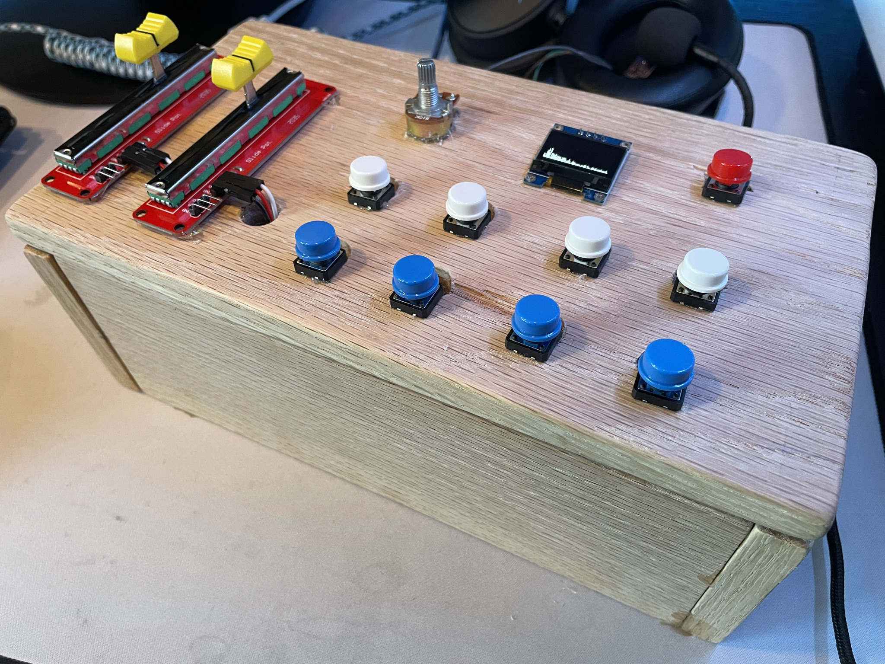
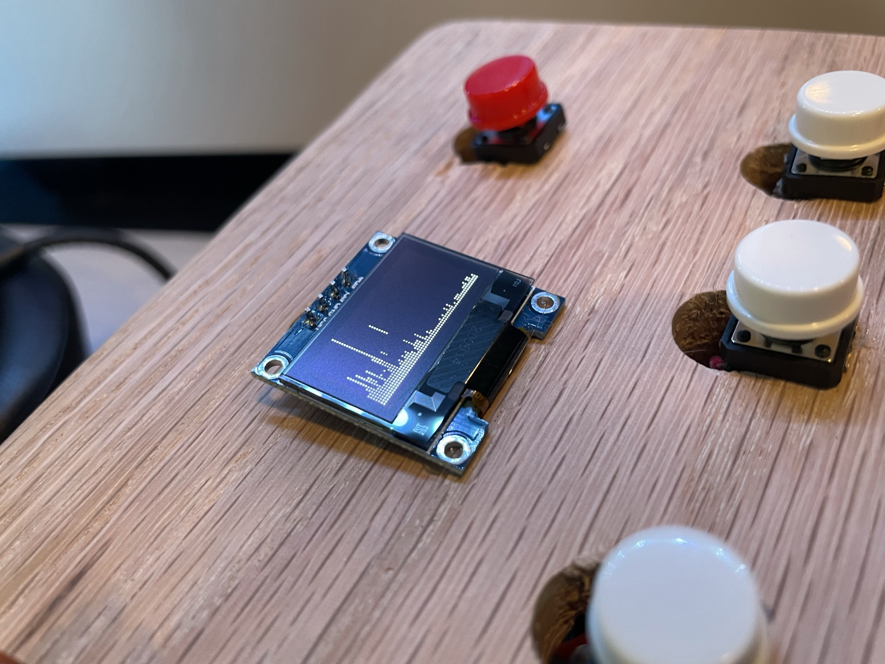
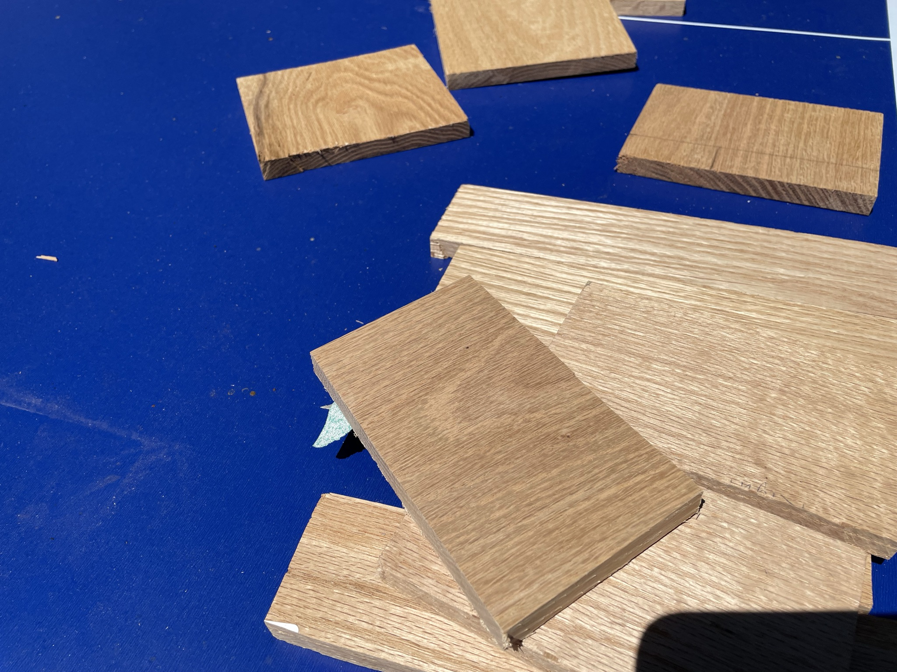
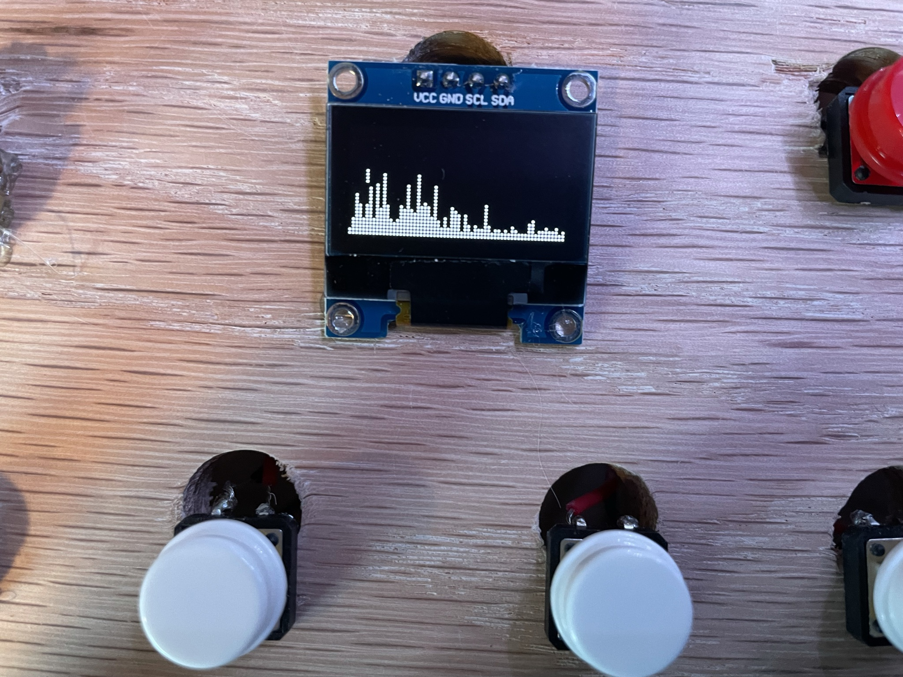
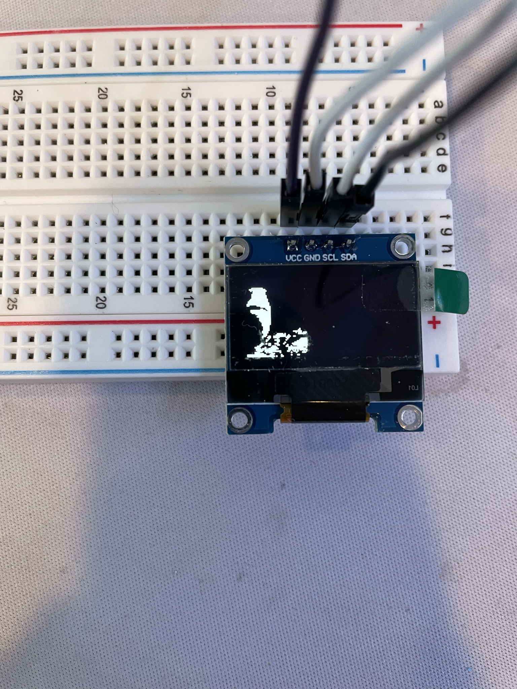
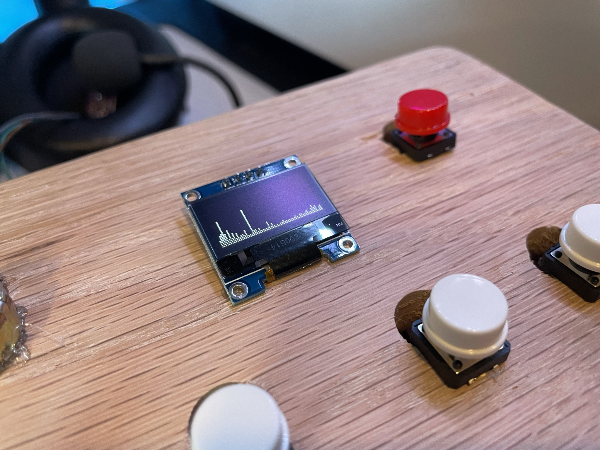
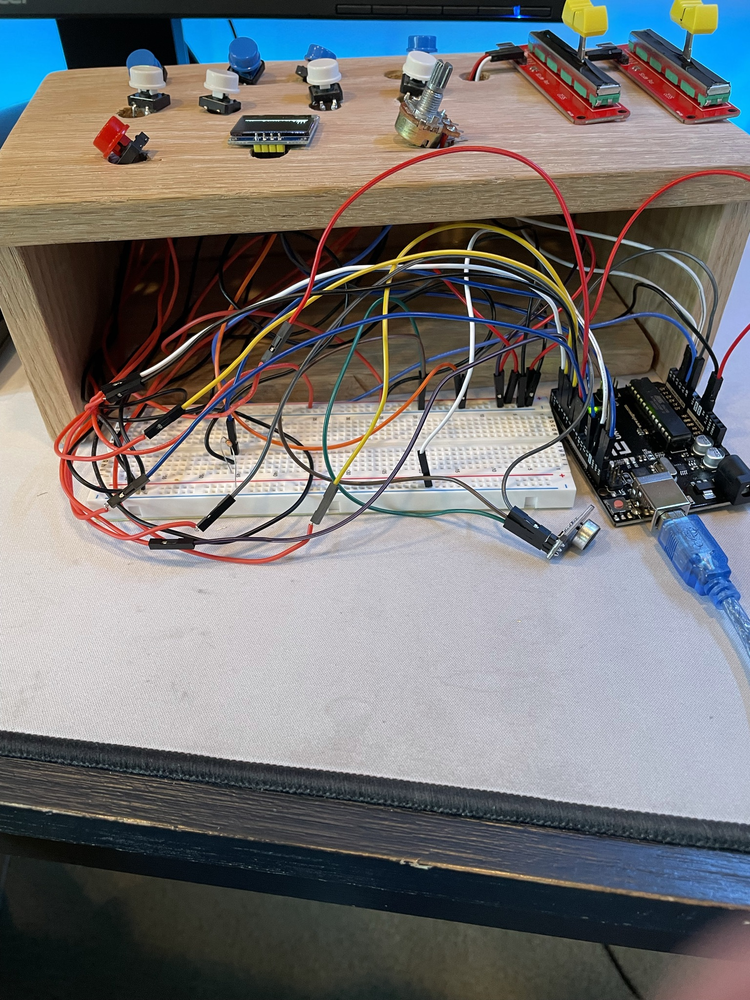

# Custom MIDI Controller
A MIDI controller is a device used to control Digital Audio Workstations, or DAWs. DAWs are common software tools used for music production. MIDI controllers typically come with many buttons, keys, and dials that the user can physically interact with to create sounds in the audio software. My project was to make a MIDI controller that can control Ableton live, a DAW.

| **Engineer** | **School** | **Area of Interest** | **Grade** |
|:--:|:--:|:--:|:--:|
| Theo Fong | Henry M. Gunn High School | Electrical/Mechanical Engineering or Music Technology| Incoming Sophomore

<html><iframe width="560" height="315" src="https://www.youtube.com/embed/0vSc_MenAMM" title="YouTube video player" frameborder="0" allow="accelerometer; autoplay; clipboard-write; encrypted-media; gyroscope; picture-in-picture" allowfullscreen></iframe></html>

# First Milestone

My first milestone of the project was creating the circuit for the controller and getting it to send a signal to the computer. To do this, I followed the provided Instructables instructions for how to wire the circuit. It is a fairly simple input circuit, with a few potentiometers and push buttons connected to an Arduino. Next, I uploaded the code that is used for custom MIDI controllers to the Arduino. With the code, the Arduino was able to tell when an input was being changed, and when that happened a signal was sent to the serial port in the Arduino software. The signal is unintelligable because a MIDI signal is being sent across a serial port, and MIDI signals must be converted across a MIDI port in order to be read.

<html><iframe width="560" height="315" src="https://www.youtube.com/embed/ZxN7ZVL8-co" title="YouTube video player" frameborder="0" allow="accelerometer; autoplay; clipboard-write; encrypted-media; gyroscope; picture-in-picture" allowfullscreen></iframe></html>

This is the circuit diagram for the device. I didn't have enough buttons, so I only used 8 of the digital inputs instead of all 12.

This is the serial output in the Arduino software. It seems like an unintelligable mix of characters, because it is. Whenever a knob or button is changed, it just writes a lot of blank squares and backwards question marks. This is because, as I explained in the video, the MIDI signal is being sent across a serial port instead of a MIDI port, where the signal would be readable.

This is the physical breadboard prototype of the MIDI controller.

# Second Milestone
My second milestone of the project was getting the MIDI controller to send a MIDI signal to a DAW and produce sounds. This step requires multiple software components in order to function.

<html><iframe width="560" height="315" src="https://www.youtube.com/embed/4MV1GSoagJA" title="YouTube video player" frameborder="0" allow="accelerometer; autoplay; clipboard-write; encrypted-media; gyroscope; picture-in-picture" allowfullscreen></iframe></html>

First, I had to get a piece of software called hairless MIDI to Serial bridge. This software converts the output from the Arduino's serial to a MIDI signal and sends it over a MIDI port. 

Since I don't have a physical MIDI port, I had to get a second piece of software that creates a virtual MIDI port, called loopMIDI. This software routes the now intelligable MIDI signal from the serial-MIDI converter to a DAW. My DAW of choice is Ableton Live 11. It's the industry standard for DAWs. The loopMIDI virtual port is then used as a MIDI input for the DAW, so the string of software allows the controller to control the software.

Next, I had to map the buttons to actually make a sound in the software. For most retail MIDI controllers, this happens automatically. But for mine, obviously, it was not pre-mapped. It was tedious to have to drag each fuction to each button, so I changed the code a little bit. I made it so that the buttons sent a signal for a note that was two octaves higher, practically auto-mapping the buttons to play drum kits. It was then fairly simple to map the potentiometers to the knob functions in the software.

The drums are automatically mapped to the section that is marked with the X, and they needed to be mapped to the section marked with the checkmark. The checkmark section is two octaves higher than the X section, so it was a fairly simple fix to change the starting note from C0 to C2.

# Final Milestone

For my final milestone, I added two modifications to my already finished base project.

<html><iframe width="560" height="315" src="https://www.youtube.com/embed/c2rp-sEI7rw" title="YouTube video player" frameborder="0" allow="accelerometer; autoplay; clipboard-write; encrypted-media; gyroscope; picture-in-picture" allowfullscreen></iframe></html>

The first one was a case. I got some wood planks, cut them, sanded them, and drilled some holes in them. Then I glued the pieces together to make a wooden box that could house my project. This was a fairly straightforward modification, unlike the other one.

My other modification was adding an audio spectrum analyzer, using an OLED screen and an external microphone unit. This audio spectrum analyzer works fairly well, however it sacrifices some responsiveness of the base project. The spectrum analyzer requires lots of processing power on one of the analog inputs on the Arduino. The other analog inputs, in turn, are not as smooth and responsive as before. The spectrum analyzer also causes the digital inputs (buttons) to be a bit slower.

At first, the spectrum analyzer seemed very daunting and challenging to add on. I searched for similar projects online, and found very few. No one had ever integrated a spectrum analyzer into a MIDI controller, either. The first step of this modification was to get the OLED screen working.

Next I got the analyzer to work on its own, independent of the MIDI controller's code. While the hardware part was simple (a microphone and an OLED connected to an Arduino), I had to do a lot of research before coding. I eventually got the analyzer to work fairly smoothly, by use of the Fast Fourier Transform algorithm.

The challenging part was integrating the code into the MIDI controller's code. I couldn't simply copy and paste the code into the other one, because there was some overlap in variables and functions in both codes. Since both codes use analog ports as inputs, I had to make it so the MIDI controller code ignored the audio input of the external mic. I changed the code so that only 3 of the 6 analog inputs were read. 

From then on, it was smooth sailing. I just had to mount my prototype in the case, and hot glue the parts in.

# Reflection

I think that this program has really helped me build engineering skills, both physically and mentally. Some physical skills include things like soldering and wiring circuits, which I think are essential foundational skills as I move forward. Mentally, I think the main lesson I've learned is to have perseverance, even if a task may seem daunting or challenging. I encountered many roadblocks along the way that seemed impossible to overcome, like fixing difficult code. However, it always seemed that as I continued to move forward, these obstacles became easier and easier to hurdle. I definitely enjoyed seeing progress throughout the project, and it was incredibly satisfying to see the project working after lots of hard work.
