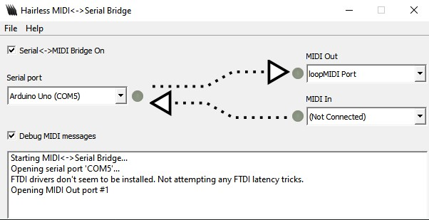
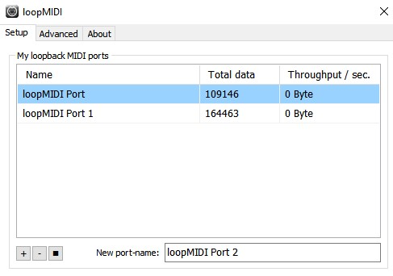
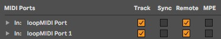
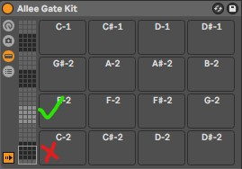
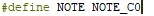
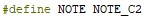
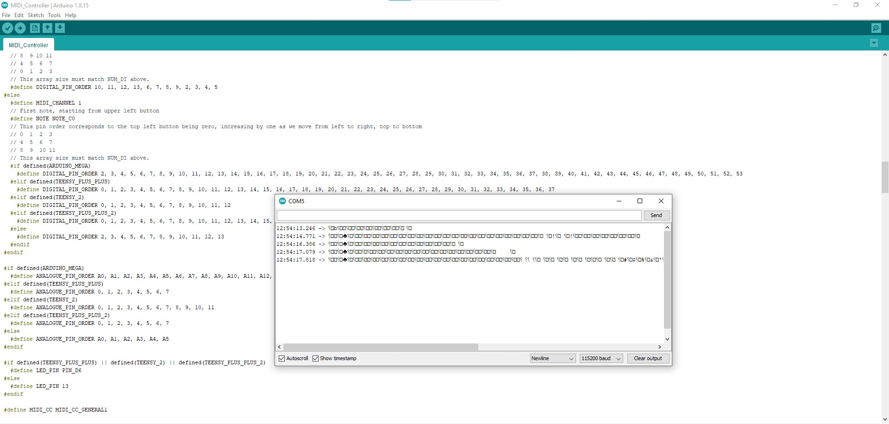
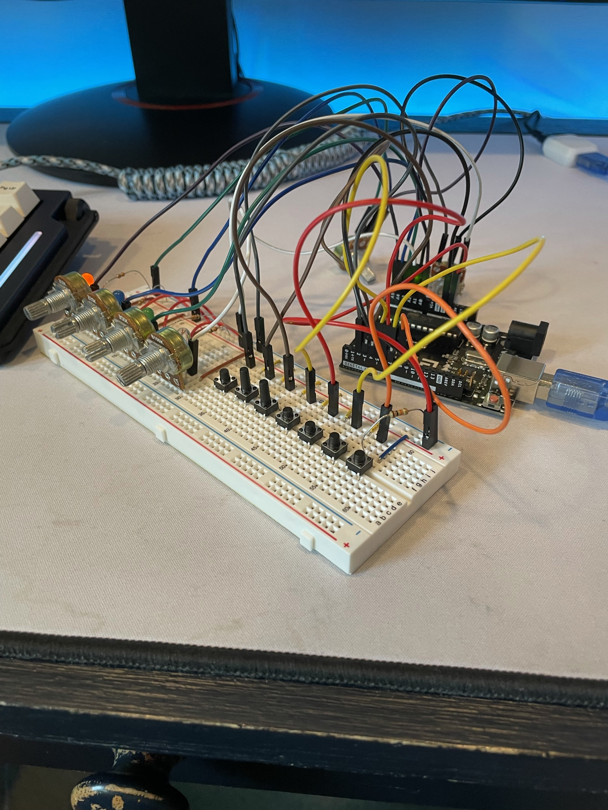

# Custom MIDI Controller
A MIDI controller is a device used to control Digital Audio Workstations, or DAWs. DAWs are a common software tool used for music production. MIDI controllers typically come with many buttons, keys, and dials that the user can physically interact with to create sounds in the audio software. My project was to make a MIDI controller that can control Ableton live, a DAW.

| **Engineer** | **School** | **Area of Interest** | **Grade** |
|:--:|:--:|:--:|:--:|
| Theo Fong | Henry M. Gunn High School | Electrical/Mechanical Engineering | Incoming Sophomore

  
# Final Milestone
My final milestone is the increased reliability and accuracy of my robot. I ameliorated the sagging and fixed the reliability of the finger. As discussed in my second milestone, the arm sags because of weight. I put in a block of wood at the base to hold up the upper arm; this has reverberating positive effects throughout the arm. I also realized that the forearm was getting disconnected from the elbow servo’s horn because of the weight stress on the joint. Now, I make sure to constantly tighten the screws at that joint. 

{:target="_blank" rel="noopener"}

# Second Milestone
My second milestone of the project was getting the MIDI controller to send a MIDI signal to a DAW and produce sounds. This step requires multiple software components in order to function.

First, I had to get a piece of software called hairless MIDI to Serial bridge. This software converts the output from the Arduino's serial to a MIDI signal and sends it over a MIDI port. 

Since I don't have a physical MIDI port, I had to get a second piece of software that creates a virtual MIDI port, called loopMIDI. This software routes the now intelligable MIDI signal from the serial-MIDI converter to a DAW. My DAW of choice is Ableton Live 11. It's the industry standard for DAWs. The loopMIDI virtual port is then used as a MIDI input for the DAW, so the string of software allows the controller to control the software.

Next, I had to map the buttons to actually make a sound in the software. For most retail MIDI controllers, this happens automatically. But for mine, obviously, it was not pre-mapped. It was tedious to have to drag each fuction to each button, so I changed the code a little bit. I made it so that the buttons sent a signal for a note that was two octaves higher, practically auto-mapping the buttons to play drum kits. It was then fairly simple to map the potentiometers to the knob functions in the software.

The drums are automatically mapped to the section that is marked with the X, and they needed to be mapped to the section marked with the checkmark. The checkmark section is two octaves higher than the X section, so it was a fairly simple fix to change the starting note from C0 to C2.

# First Milestone
  

My first milestone of the project was creating the circuit for the controller and getting it to send a signal to the computer. To do this, I followed the provided Instructables instructions for how to wire the circuit. It is a fairly simple input circuit, with a few potentiometers and push buttons connected to an Arduino. Next, I uploaded the code that is used for custom MIDI controllers to the Arduino. With the code, the Arduino was able to tell when an input was being changed, and when that happened a signal was sent to the serial port in the Arduino software. The signal is unintelligable because a MIDI signal is being sent across a serial port, and MIDI signals must be converted across a MIDI port in order to be read.

<html><iframe width="560" height="315" src="https://www.youtube.com/embed/ZxN7ZVL8-co" title="YouTube video player" frameborder="0" allow="accelerometer; autoplay; clipboard-write; encrypted-media; gyroscope; picture-in-picture" allowfullscreen></iframe></html>

This is the circuit diagram for the device. I didn't have enough buttons, so I only used 8 of the digital inputs instead of all 12.

This is the serial output in the Arduino software. It seems like an unintelligable mix of characters, because it is. Whenever a knob or button is changed, it just writes a lot of blank squares and backwards question marks. This is because, as I explained in the video, the MIDI signal is being sent across a serial port instead of a MIDI port, where the signal would be readable.

This is the physical prototype of the MIDI controller.

